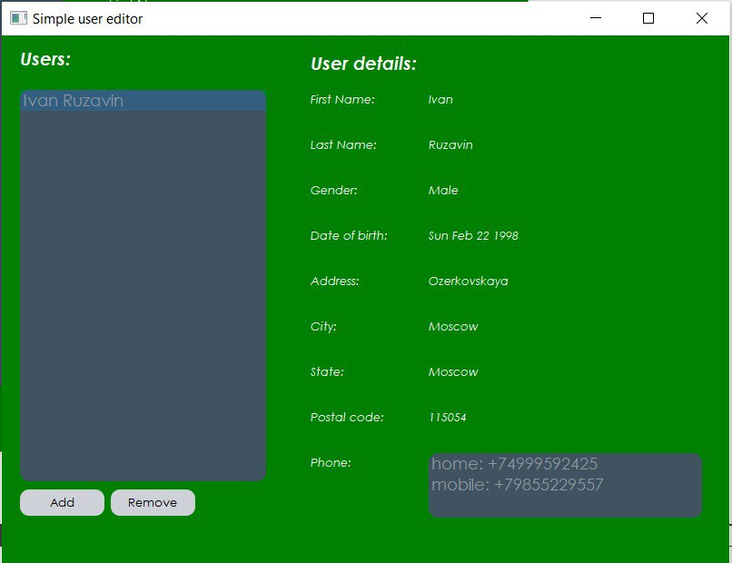
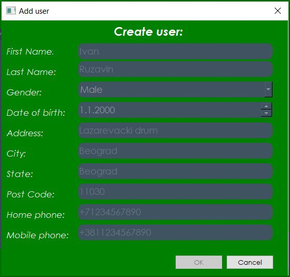
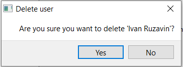

# Simple-User-Editor
Simple application to work with users made with Qt

## How to work with this app:

1) Press the "Add" button and input the information into the suitable text boxes (note that you must fill every box with text except "Post Code", "Home phone" and "Mobile phone" boxes - there you should write only numbers)

2) After additing new user you can click on his name and see the full information about him on the right.

3) You can remove clicked user with the help of "Remove" button.

### Enjoy!
